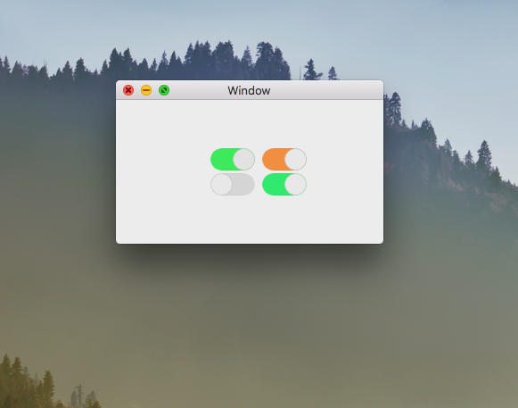

# NSSwitch

UISwitch clone for macOS.

[](https://travis-ci.org/Hayden Pennington/NSSwitch)
[](http://cocoapods.org/pods/NSSwitch)
[](http://cocoapods.org/pods/NSSwitch)
[](http://cocoapods.org/pods/NSSwitch)

## Image


## Disclamer
NSSwitch is in early development and is subject to change without notice.

## Installation

NSSwitch is available through [CocoaPods](http://cocoapods.org). To install
it, simply add the following line to your Podfile:

```ruby
pod "NSSwitch"
```

## Author

Hayden Pennington, haydenpennington@icloud.com

## License

NSSwitch is available under the MIT license. See the LICENSE file for more info.
