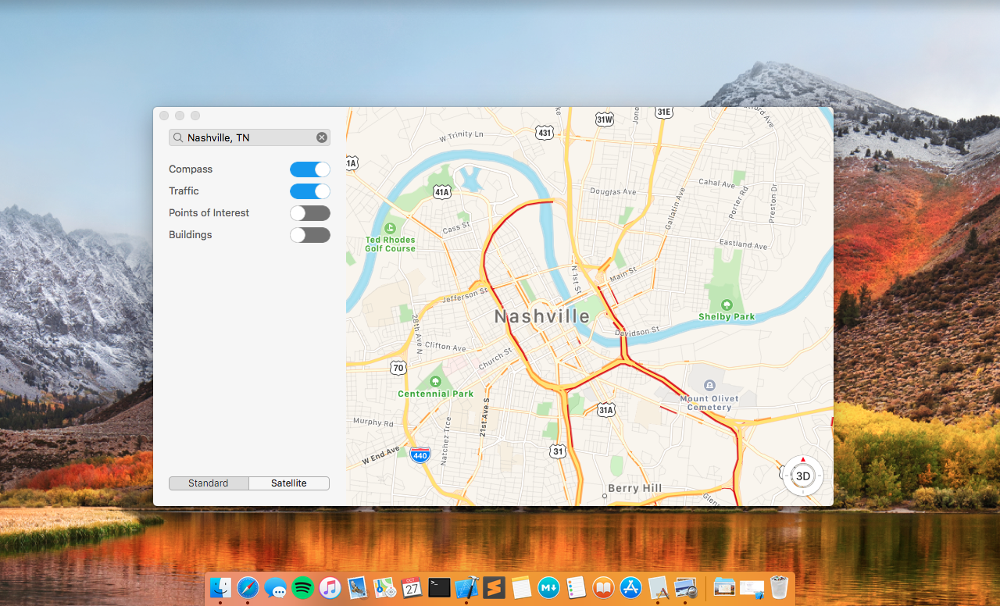

# NSSwitch

UISwitch for macOS.


[](http://cocoapods.org/pods/NSSwitch)




## Installation

#### Carthage

- Add NSSwitch dependency to the Cartfile:
```
	github "https://github.com/hpennington/NSSwitch.git"
```

#### CocoaPods

NSSwitch is alxo available through [CocoaPods](http://cocoapods.org). To install
it, simply add the following line to your Podfile:

```
pod "NSSwitch"
```

## Author

Hayden Pennington, haydenpennington@icloud.com

## License

NSSwitch is available under the MIT license. See the LICENSE file for more info.

